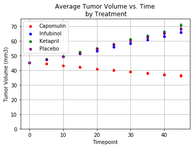
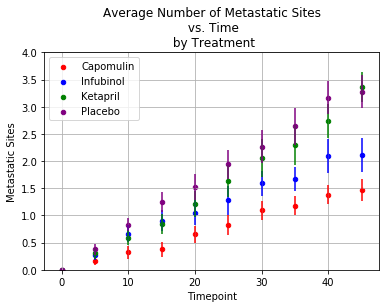
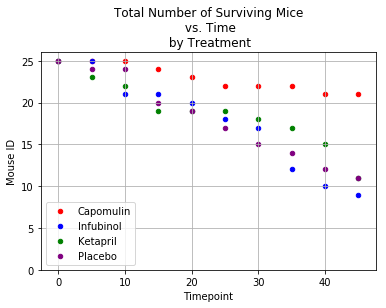
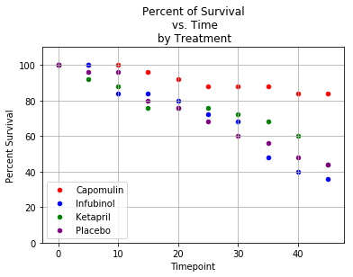
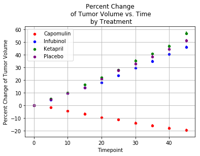
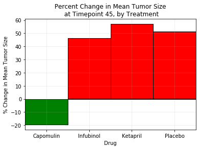

# Clinical Trial Analysis


In this demonstration, I will analyze clinical trial data to determine the effects of four potential squamous cell carcinoma drugs.

Data from a fictional animal study can be found in the input data folder. In this study, 250 mice were treated through a variety of drug regimes over the course of 45 days. Their physiological responses were then monitored over the course of that time. The objective of the analysis will be to show how four treatments (Capomulin, Infubinol, Ketapril, and Placebo) compare.

In order to compare the drugs' effects, we will:


 - Create a scatter plot that shows how the tumor volume changes over time for each treatment.
 - Create a scatter plot that shows how the number of metastatic (cancer spreading) sites changes over time for each treatment.
 - Create a scatter plot that shows the number of mice still alive through the course of treatment (Survival Rate)
 - Create a bar graph that compares the total % tumor volume change for each drug across the full 45 days.


As final considerations:


 - We will include error bars (SEM) in the plots. This will allow the company to account for variability between mice. 
 - We will indicate tumor growth as red and tumor reduction as green in the bar graph.
 - We will also include a label with the percentage change for each bar.

### Import dependencies:


```python
import pandas as pd
import numpy as np
import matplotlib.pyplot as plt
```


    <matplotlib.figure.Figure at 0x12024fb00>


### Load ```.csv```s


```python
# create dataframes from csv files
trial_csv = pd.read_csv('input_data/clinicaltrial_data.csv')
mouse_csv = pd.read_csv('input_data/mouse_drug_data.csv')
trial = pd.DataFrame(trial_csv)
mouse = pd.DataFrame(mouse_csv)
```

### Explore data


```python
trial.head()
```


<div>
<style scoped>
    .dataframe tbody tr th:only-of-type {
        vertical-align: middle;
    }

    .dataframe tbody tr th {
        vertical-align: top;
    }

    .dataframe thead th {
        text-align: right;
    }
</style>
<table border="1" class="dataframe">
  <thead>
    <tr style="text-align: right;">
      <th></th>
      <th>Mouse ID</th>
      <th>Timepoint</th>
      <th>Tumor Volume (mm3)</th>
      <th>Metastatic Sites</th>
    </tr>
  </thead>
  <tbody>
    <tr>
      <th>0</th>
      <td>b128</td>
      <td>0</td>
      <td>45.0</td>
      <td>0</td>
    </tr>
    <tr>
      <th>1</th>
      <td>f932</td>
      <td>0</td>
      <td>45.0</td>
      <td>0</td>
    </tr>
    <tr>
      <th>2</th>
      <td>g107</td>
      <td>0</td>
      <td>45.0</td>
      <td>0</td>
    </tr>
    <tr>
      <th>3</th>
      <td>a457</td>
      <td>0</td>
      <td>45.0</td>
      <td>0</td>
    </tr>
    <tr>
      <th>4</th>
      <td>c819</td>
      <td>0</td>
      <td>45.0</td>
      <td>0</td>
    </tr>
  </tbody>
</table>
</div>


```python
trial.index
```


    RangeIndex(start=0, stop=1893, step=1)


```python
trial.dtypes
```


    Mouse ID               object
    Timepoint               int64
    Tumor Volume (mm3)    float64
    Metastatic Sites        int64
    dtype: object


```python
mouse.head()
```


<div>
<style scoped>
    .dataframe tbody tr th:only-of-type {
        vertical-align: middle;
    }

    .dataframe tbody tr th {
        vertical-align: top;
    }

    .dataframe thead th {
        text-align: right;
    }
</style>
<table border="1" class="dataframe">
  <thead>
    <tr style="text-align: right;">
      <th></th>
      <th>Mouse ID</th>
      <th>Drug</th>
    </tr>
  </thead>
  <tbody>
    <tr>
      <th>0</th>
      <td>f234</td>
      <td>Stelasyn</td>
    </tr>
    <tr>
      <th>1</th>
      <td>x402</td>
      <td>Stelasyn</td>
    </tr>
    <tr>
      <th>2</th>
      <td>a492</td>
      <td>Stelasyn</td>
    </tr>
    <tr>
      <th>3</th>
      <td>w540</td>
      <td>Stelasyn</td>
    </tr>
    <tr>
      <th>4</th>
      <td>v764</td>
      <td>Stelasyn</td>
    </tr>
  </tbody>
</table>
</div>


```python
mouse.index
```


    RangeIndex(start=0, stop=250, step=1)


```python
mouse.dtypes
```


    Mouse ID    object
    Drug        object
    dtype: object


## Tumor volume over time by treatment:
First step is to join the two dataframes to cross reference


```python
together = trial.merge(mouse, on='Mouse ID', how='left')
```


```python
together.head()
```


<div>
<style scoped>
    .dataframe tbody tr th:only-of-type {
        vertical-align: middle;
    }

    .dataframe tbody tr th {
        vertical-align: top;
    }

    .dataframe thead th {
        text-align: right;
    }
</style>
<table border="1" class="dataframe">
  <thead>
    <tr style="text-align: right;">
      <th></th>
      <th>Mouse ID</th>
      <th>Timepoint</th>
      <th>Tumor Volume (mm3)</th>
      <th>Metastatic Sites</th>
      <th>Drug</th>
    </tr>
  </thead>
  <tbody>
    <tr>
      <th>0</th>
      <td>b128</td>
      <td>0</td>
      <td>45.0</td>
      <td>0</td>
      <td>Capomulin</td>
    </tr>
    <tr>
      <th>1</th>
      <td>f932</td>
      <td>0</td>
      <td>45.0</td>
      <td>0</td>
      <td>Ketapril</td>
    </tr>
    <tr>
      <th>2</th>
      <td>g107</td>
      <td>0</td>
      <td>45.0</td>
      <td>0</td>
      <td>Ketapril</td>
    </tr>
    <tr>
      <th>3</th>
      <td>a457</td>
      <td>0</td>
      <td>45.0</td>
      <td>0</td>
      <td>Ketapril</td>
    </tr>
    <tr>
      <th>4</th>
      <td>c819</td>
      <td>0</td>
      <td>45.0</td>
      <td>0</td>
      <td>Ketapril</td>
    </tr>
  </tbody>
</table>
</div>


Then we:
- groupby drug and timepoint respectively
- display the mean of tumor volumes at each timepoint as a summary statistic


```python
drug_time_group = together.groupby(['Drug','Timepoint'])
```


```python
avtumor = pd.DataFrame(drug_time_group['Tumor Volume (mm3)'].agg({'Tumor Volume (mm3)': 'mean',
                                                                  'Std. Error': 'sem'})).reset_index()

avtumor
```

    /anaconda/lib/python3.6/site-packages/ipykernel_launcher.py:2: FutureWarning: using a dict on a Series for aggregation
    is deprecated and will be removed in a future version
      


<div>
<style scoped>
    .dataframe tbody tr th:only-of-type {
        vertical-align: middle;
    }

    .dataframe tbody tr th {
        vertical-align: top;
    }

    .dataframe thead th {
        text-align: right;
    }
</style>
<table border="1" class="dataframe">
  <thead>
    <tr style="text-align: right;">
      <th></th>
      <th>Drug</th>
      <th>Timepoint</th>
      <th>Tumor Volume (mm3)</th>
      <th>Std. Error</th>
    </tr>
  </thead>
  <tbody>
    <tr>
      <th>0</th>
      <td>Capomulin</td>
      <td>0</td>
      <td>45.000000</td>
      <td>0.000000</td>
    </tr>
    <tr>
      <th>1</th>
      <td>Capomulin</td>
      <td>5</td>
      <td>44.266086</td>
      <td>0.448593</td>
    </tr>
    <tr>
      <th>2</th>
      <td>Capomulin</td>
      <td>10</td>
      <td>43.084291</td>
      <td>0.702684</td>
    </tr>
    <tr>
      <th>3</th>
      <td>Capomulin</td>
      <td>15</td>
      <td>42.064317</td>
      <td>0.838617</td>
    </tr>
    <tr>
      <th>4</th>
      <td>Capomulin</td>
      <td>20</td>
      <td>40.716325</td>
      <td>0.909731</td>
    </tr>
    <tr>
      <th>5</th>
      <td>Capomulin</td>
      <td>25</td>
      <td>39.939528</td>
      <td>0.881642</td>
    </tr>
    <tr>
      <th>6</th>
      <td>Capomulin</td>
      <td>30</td>
      <td>38.769339</td>
      <td>0.934460</td>
    </tr>
    <tr>
      <th>7</th>
      <td>Capomulin</td>
      <td>35</td>
      <td>37.816839</td>
      <td>1.052241</td>
    </tr>
    <tr>
      <th>8</th>
      <td>Capomulin</td>
      <td>40</td>
      <td>36.958001</td>
      <td>1.223608</td>
    </tr>
    <tr>
      <th>9</th>
      <td>Capomulin</td>
      <td>45</td>
      <td>36.236114</td>
      <td>1.223977</td>
    </tr>
    <tr>
      <th>10</th>
      <td>Ceftamin</td>
      <td>0</td>
      <td>45.000000</td>
      <td>0.000000</td>
    </tr>
    <tr>
      <th>11</th>
      <td>Ceftamin</td>
      <td>5</td>
      <td>46.503051</td>
      <td>0.164505</td>
    </tr>
    <tr>
      <th>12</th>
      <td>Ceftamin</td>
      <td>10</td>
      <td>48.285125</td>
      <td>0.236144</td>
    </tr>
    <tr>
      <th>13</th>
      <td>Ceftamin</td>
      <td>15</td>
      <td>50.094055</td>
      <td>0.332053</td>
    </tr>
    <tr>
      <th>14</th>
      <td>Ceftamin</td>
      <td>20</td>
      <td>52.157049</td>
      <td>0.359482</td>
    </tr>
    <tr>
      <th>15</th>
      <td>Ceftamin</td>
      <td>25</td>
      <td>54.287674</td>
      <td>0.439356</td>
    </tr>
    <tr>
      <th>16</th>
      <td>Ceftamin</td>
      <td>30</td>
      <td>56.769517</td>
      <td>0.490620</td>
    </tr>
    <tr>
      <th>17</th>
      <td>Ceftamin</td>
      <td>35</td>
      <td>58.827548</td>
      <td>0.692248</td>
    </tr>
    <tr>
      <th>18</th>
      <td>Ceftamin</td>
      <td>40</td>
      <td>61.467895</td>
      <td>0.708505</td>
    </tr>
    <tr>
      <th>19</th>
      <td>Ceftamin</td>
      <td>45</td>
      <td>64.132421</td>
      <td>0.902358</td>
    </tr>
    <tr>
      <th>20</th>
      <td>Infubinol</td>
      <td>0</td>
      <td>45.000000</td>
      <td>0.000000</td>
    </tr>
    <tr>
      <th>21</th>
      <td>Infubinol</td>
      <td>5</td>
      <td>47.062001</td>
      <td>0.235102</td>
    </tr>
    <tr>
      <th>22</th>
      <td>Infubinol</td>
      <td>10</td>
      <td>49.403909</td>
      <td>0.282346</td>
    </tr>
    <tr>
      <th>23</th>
      <td>Infubinol</td>
      <td>15</td>
      <td>51.296397</td>
      <td>0.357705</td>
    </tr>
    <tr>
      <th>24</th>
      <td>Infubinol</td>
      <td>20</td>
      <td>53.197691</td>
      <td>0.476210</td>
    </tr>
    <tr>
      <th>25</th>
      <td>Infubinol</td>
      <td>25</td>
      <td>55.715252</td>
      <td>0.550315</td>
    </tr>
    <tr>
      <th>26</th>
      <td>Infubinol</td>
      <td>30</td>
      <td>58.299397</td>
      <td>0.631061</td>
    </tr>
    <tr>
      <th>27</th>
      <td>Infubinol</td>
      <td>35</td>
      <td>60.742461</td>
      <td>0.984155</td>
    </tr>
    <tr>
      <th>28</th>
      <td>Infubinol</td>
      <td>40</td>
      <td>63.162824</td>
      <td>1.055220</td>
    </tr>
    <tr>
      <th>29</th>
      <td>Infubinol</td>
      <td>45</td>
      <td>65.755562</td>
      <td>1.144427</td>
    </tr>
    <tr>
      <th>...</th>
      <td>...</td>
      <td>...</td>
      <td>...</td>
      <td>...</td>
    </tr>
    <tr>
      <th>70</th>
      <td>Ramicane</td>
      <td>0</td>
      <td>45.000000</td>
      <td>0.000000</td>
    </tr>
    <tr>
      <th>71</th>
      <td>Ramicane</td>
      <td>5</td>
      <td>43.944859</td>
      <td>0.482955</td>
    </tr>
    <tr>
      <th>72</th>
      <td>Ramicane</td>
      <td>10</td>
      <td>42.531957</td>
      <td>0.720225</td>
    </tr>
    <tr>
      <th>73</th>
      <td>Ramicane</td>
      <td>15</td>
      <td>41.495061</td>
      <td>0.770432</td>
    </tr>
    <tr>
      <th>74</th>
      <td>Ramicane</td>
      <td>20</td>
      <td>40.238325</td>
      <td>0.786199</td>
    </tr>
    <tr>
      <th>75</th>
      <td>Ramicane</td>
      <td>25</td>
      <td>38.974300</td>
      <td>0.746991</td>
    </tr>
    <tr>
      <th>76</th>
      <td>Ramicane</td>
      <td>30</td>
      <td>38.703137</td>
      <td>0.864906</td>
    </tr>
    <tr>
      <th>77</th>
      <td>Ramicane</td>
      <td>35</td>
      <td>37.451996</td>
      <td>0.967433</td>
    </tr>
    <tr>
      <th>78</th>
      <td>Ramicane</td>
      <td>40</td>
      <td>36.574081</td>
      <td>1.128445</td>
    </tr>
    <tr>
      <th>79</th>
      <td>Ramicane</td>
      <td>45</td>
      <td>34.955595</td>
      <td>1.226805</td>
    </tr>
    <tr>
      <th>80</th>
      <td>Stelasyn</td>
      <td>0</td>
      <td>45.000000</td>
      <td>0.000000</td>
    </tr>
    <tr>
      <th>81</th>
      <td>Stelasyn</td>
      <td>5</td>
      <td>47.527452</td>
      <td>0.239862</td>
    </tr>
    <tr>
      <th>82</th>
      <td>Stelasyn</td>
      <td>10</td>
      <td>49.463844</td>
      <td>0.433678</td>
    </tr>
    <tr>
      <th>83</th>
      <td>Stelasyn</td>
      <td>15</td>
      <td>51.529409</td>
      <td>0.493261</td>
    </tr>
    <tr>
      <th>84</th>
      <td>Stelasyn</td>
      <td>20</td>
      <td>54.067395</td>
      <td>0.621889</td>
    </tr>
    <tr>
      <th>85</th>
      <td>Stelasyn</td>
      <td>25</td>
      <td>56.166123</td>
      <td>0.741922</td>
    </tr>
    <tr>
      <th>86</th>
      <td>Stelasyn</td>
      <td>30</td>
      <td>59.826738</td>
      <td>0.899548</td>
    </tr>
    <tr>
      <th>87</th>
      <td>Stelasyn</td>
      <td>35</td>
      <td>62.440699</td>
      <td>1.003186</td>
    </tr>
    <tr>
      <th>88</th>
      <td>Stelasyn</td>
      <td>40</td>
      <td>65.356386</td>
      <td>1.410435</td>
    </tr>
    <tr>
      <th>89</th>
      <td>Stelasyn</td>
      <td>45</td>
      <td>68.438310</td>
      <td>1.576556</td>
    </tr>
    <tr>
      <th>90</th>
      <td>Zoniferol</td>
      <td>0</td>
      <td>45.000000</td>
      <td>0.000000</td>
    </tr>
    <tr>
      <th>91</th>
      <td>Zoniferol</td>
      <td>5</td>
      <td>46.851818</td>
      <td>0.188950</td>
    </tr>
    <tr>
      <th>92</th>
      <td>Zoniferol</td>
      <td>10</td>
      <td>48.689881</td>
      <td>0.263949</td>
    </tr>
    <tr>
      <th>93</th>
      <td>Zoniferol</td>
      <td>15</td>
      <td>50.779059</td>
      <td>0.370544</td>
    </tr>
    <tr>
      <th>94</th>
      <td>Zoniferol</td>
      <td>20</td>
      <td>53.170334</td>
      <td>0.533182</td>
    </tr>
    <tr>
      <th>95</th>
      <td>Zoniferol</td>
      <td>25</td>
      <td>55.432935</td>
      <td>0.602513</td>
    </tr>
    <tr>
      <th>96</th>
      <td>Zoniferol</td>
      <td>30</td>
      <td>57.713531</td>
      <td>0.800043</td>
    </tr>
    <tr>
      <th>97</th>
      <td>Zoniferol</td>
      <td>35</td>
      <td>60.089372</td>
      <td>0.881426</td>
    </tr>
    <tr>
      <th>98</th>
      <td>Zoniferol</td>
      <td>40</td>
      <td>62.916692</td>
      <td>0.998515</td>
    </tr>
    <tr>
      <th>99</th>
      <td>Zoniferol</td>
      <td>45</td>
      <td>65.960888</td>
      <td>1.003576</td>
    </tr>
  </tbody>
</table>
<p>100 rows × 4 columns</p>
</div>


Then we create separate dataframes for each plot group:


```python
capo = avtumor[avtumor['Drug'] == 'Capomulin']
infu = avtumor[avtumor['Drug'] == 'Infubinol']
keta = avtumor[avtumor['Drug'] == 'Ketapril']
plac = avtumor[avtumor['Drug'] == 'Placebo']
capo.head()
```


<div>
<style scoped>
    .dataframe tbody tr th:only-of-type {
        vertical-align: middle;
    }

    .dataframe tbody tr th {
        vertical-align: top;
    }

    .dataframe thead th {
        text-align: right;
    }
</style>
<table border="1" class="dataframe">
  <thead>
    <tr style="text-align: right;">
      <th></th>
      <th>Drug</th>
      <th>Timepoint</th>
      <th>Tumor Volume (mm3)</th>
      <th>Std. Error</th>
    </tr>
  </thead>
  <tbody>
    <tr>
      <th>0</th>
      <td>Capomulin</td>
      <td>0</td>
      <td>45.000000</td>
      <td>0.000000</td>
    </tr>
    <tr>
      <th>1</th>
      <td>Capomulin</td>
      <td>5</td>
      <td>44.266086</td>
      <td>0.448593</td>
    </tr>
    <tr>
      <th>2</th>
      <td>Capomulin</td>
      <td>10</td>
      <td>43.084291</td>
      <td>0.702684</td>
    </tr>
    <tr>
      <th>3</th>
      <td>Capomulin</td>
      <td>15</td>
      <td>42.064317</td>
      <td>0.838617</td>
    </tr>
    <tr>
      <th>4</th>
      <td>Capomulin</td>
      <td>20</td>
      <td>40.716325</td>
      <td>0.909731</td>
    </tr>
  </tbody>
</table>
</div>


Then we plot each group separately, assigning a proper label and different color each time.
- To make them show up on the same plot, we assign each to a variable, then pass in that variable into ```ax=``` each time


```python
ax = capo.plot(x='Timepoint',
               y='Tumor Volume (mm3)',
               kind='scatter',
               color='red',
               label='Capomulin',
               yerr='Std. Error')

ax2 = infu.plot(x='Timepoint',
                y='Tumor Volume (mm3)',
                kind='scatter',
                color='blue',
                label='Infubinol',
                ax=ax,
                yerr='Std. Error')

ax3 = keta.plot(x='Timepoint',
                y='Tumor Volume (mm3)',
                kind='scatter',
                color='green',
                label='Ketapril',
                ax=ax2,
                yerr='Std. Error')

plac.plot(x='Timepoint',
          y='Tumor Volume (mm3)',
          kind='scatter',
          color='purple',
          label='Placebo',
          ax=ax3,
          yerr='Std. Error')
```


    <matplotlib.axes._subplots.AxesSubplot at 0x11d804668>


Then add titles, a grid, and adjust the y-axis to start from zero


```python

plt.grid()
plt.title('Average Tumor Volume vs. Time\n by Treatment')
plt.ylim(0, 75)
```


    (0, 75)


```python
plt.show()
```





    <matplotlib.figure.Figure at 0x11fd20630>


Above, we can see that Capomulin seems to have an effect on Tumor size.

## Metastatic sites over time
This we be the same as above, but for metastatic sites.
- mean is chosen as a summary statistic because sum would be affected by mortality between groups.


```python
drug_time_group = together.groupby(['Drug','Timepoint'])
```


```python
avmeta = pd.DataFrame(drug_time_group['Metastatic Sites'].agg({'Metastatic Sites': 'mean',
                                                               'Std. Error': 'sem'})).reset_index()
```

    /anaconda/lib/python3.6/site-packages/ipykernel_launcher.py:2: FutureWarning: using a dict on a Series for aggregation
    is deprecated and will be removed in a future version
      


```python
capo = avmeta[avmeta['Drug'] == 'Capomulin']
infu = avmeta[avmeta['Drug'] == 'Infubinol']
keta = avmeta[avmeta['Drug'] == 'Ketapril']
plac = avmeta[avmeta['Drug'] == 'Placebo']
```


```python
ax = capo.plot(x='Timepoint', y='Metastatic Sites', kind='scatter', color='red', label='Capomulin', yerr='Std. Error')
ax2 = infu.plot(x='Timepoint', y='Metastatic Sites', kind='scatter', color='blue', label='Infubinol', ax=ax, yerr='Std. Error')
ax3 = keta.plot(x='Timepoint', y='Metastatic Sites', kind='scatter', color='green', label='Ketapril', ax=ax2, yerr='Std. Error')
plac.plot(x='Timepoint', y='Metastatic Sites', kind='scatter', color='purple', label='Placebo', ax=ax3, yerr='Std. Error')
```


    <matplotlib.axes._subplots.AxesSubplot at 0x11d7ee908>


```python
plt.grid()
plt.title('Average Number of Metastatic Sites\n vs. Time\n by Treatment')
plt.ylim(0, 4)
plt.show()
```





Again, Capomulin treatment seems to produce the greatest reduction of metastatic site number.

## Survival over time
This will be the same as above, but for survival.
- To complete this portion, we will either have to:
  - Add a column to the original joined dataframe for number of surviving mice for each drug at each timepoint, then groupby and use .mean as before, or
  - Use .count() as the summary statistic after grouping.
 
Lets try the latter:


```python
drug_time_group = together.groupby(['Drug','Timepoint'])
# pick any column and count
micenum = pd.DataFrame(drug_time_group['Mouse ID'].count()).reset_index()

capo = micenum[micenum['Drug'] == 'Capomulin']
infu = micenum[micenum['Drug'] == 'Infubinol']
keta = micenum[micenum['Drug'] == 'Ketapril']
plac = micenum[micenum['Drug'] == 'Placebo']

ax = capo.plot(x='Timepoint', y='Mouse ID', kind='scatter', color='red', label='Capomulin')
ax2 = infu.plot(x='Timepoint', y='Mouse ID', kind='scatter', color='blue', label='Infubinol', ax=ax)
ax3 = keta.plot(x='Timepoint', y='Mouse ID', kind='scatter', color='green', label='Ketapril', ax=ax2)
plac.plot(x='Timepoint', y='Mouse ID', kind='scatter', color='purple', label='Placebo', ax=ax3)

plt.grid()
plt.title('Total Number of Surviving Mice\n vs. Time\n by Treatment')
plt.ylim(0, 26)
plt.show()
```





Again, Capomulin comes out ahead, with the highest survival numbers at timepoint 45.
- if we wanted the survival rate in percent, we could do the following:


```python
drug_time_group = together.groupby(['Drug','Timepoint'])

# pick any column and count
micepct = pd.DataFrame(drug_time_group['Mouse ID'].count()).reset_index()

capo = micepct[micepct['Drug'] == 'Capomulin']
infu = micepct[micepct['Drug'] == 'Infubinol']
keta = micepct[micepct['Drug'] == 'Ketapril']
plac = micepct[micepct['Drug'] == 'Placebo']

origcapo = together[(together['Drug'] == 'Capomulin') & (together['Timepoint'] == 0)]['Mouse ID'].count()
originfu = together[(together['Drug'] == 'Infubinol') & (together['Timepoint'] == 0)]['Mouse ID'].count()
origketa = together[(together['Drug'] == 'Ketapril') & (together['Timepoint'] == 0)]['Mouse ID'].count()
origplac = together[(together['Drug'] == 'Placebo') & (together['Timepoint'] == 0)]['Mouse ID'].count()
```


```python
capo['Percent Survival'] = capo['Mouse ID'] / origcapo * 100
infu['Percent Survival'] = infu['Mouse ID'] / originfu * 100
keta['Percent Survival'] = keta['Mouse ID'] / origketa * 100
plac['Percent Survival'] = plac['Mouse ID'] / origplac * 100

```

    /anaconda/lib/python3.6/site-packages/ipykernel_launcher.py:1: SettingWithCopyWarning: 
    A value is trying to be set on a copy of a slice from a DataFrame.
    Try using .loc[row_indexer,col_indexer] = value instead
    
    See the caveats in the documentation: http://pandas.pydata.org/pandas-docs/stable/indexing.html#indexing-view-versus-copy
      """Entry point for launching an IPython kernel.
    /anaconda/lib/python3.6/site-packages/ipykernel_launcher.py:2: SettingWithCopyWarning: 
    A value is trying to be set on a copy of a slice from a DataFrame.
    Try using .loc[row_indexer,col_indexer] = value instead
    
    See the caveats in the documentation: http://pandas.pydata.org/pandas-docs/stable/indexing.html#indexing-view-versus-copy
      
    /anaconda/lib/python3.6/site-packages/ipykernel_launcher.py:3: SettingWithCopyWarning: 
    A value is trying to be set on a copy of a slice from a DataFrame.
    Try using .loc[row_indexer,col_indexer] = value instead
    
    See the caveats in the documentation: http://pandas.pydata.org/pandas-docs/stable/indexing.html#indexing-view-versus-copy
      This is separate from the ipykernel package so we can avoid doing imports until
    /anaconda/lib/python3.6/site-packages/ipykernel_launcher.py:4: SettingWithCopyWarning: 
    A value is trying to be set on a copy of a slice from a DataFrame.
    Try using .loc[row_indexer,col_indexer] = value instead
    
    See the caveats in the documentation: http://pandas.pydata.org/pandas-docs/stable/indexing.html#indexing-view-versus-copy
      after removing the cwd from sys.path.


```python
ax = capo.plot(x='Timepoint', y='Percent Survival', kind='scatter', color='red', label='Capomulin')
ax2 = infu.plot(x='Timepoint', y='Percent Survival', kind='scatter', color='blue', label='Infubinol', ax=ax)
ax3 = keta.plot(x='Timepoint', y='Percent Survival', kind='scatter', color='green', label='Ketapril', ax=ax2)
plac.plot(x='Timepoint', y='Percent Survival', kind='scatter', color='purple', label='Placebo', ax=ax3)

plt.grid()
plt.title('Percent of Survival\n vs. Time\n by Treatment')
plt.ylim(0, 110)
plt.show()
```





This produces a similar result as above.

## Total % tumor volume change:
This will be similar to the above percent survival plot, except that the:
- summary statistic after groupby will be mean tumor volume
- original value will be tumor volume at timepoint zero


```python
drug_time_group = together.groupby(['Drug','Timepoint'])

# pick any column and count
micepct = pd.DataFrame(drug_time_group['Tumor Volume (mm3)'].agg({'Tumor Volume (mm3)':'mean',
                                                                  'Std. Error': 'sem'})).reset_index()

capo = micepct[micepct['Drug'] == 'Capomulin']
infu = micepct[micepct['Drug'] == 'Infubinol']
keta = micepct[micepct['Drug'] == 'Ketapril']
plac = micepct[micepct['Drug'] == 'Placebo']

origcapo = together[(together['Drug'] == 'Capomulin') & (together['Timepoint'] == 0)]['Tumor Volume (mm3)'].mean()
originfu = together[(together['Drug'] == 'Infubinol') & (together['Timepoint'] == 0)]['Tumor Volume (mm3)'].mean()
origketa = together[(together['Drug'] == 'Ketapril') & (together['Timepoint'] == 0)]['Tumor Volume (mm3)'].mean()
origplac = together[(together['Drug'] == 'Placebo') & (together['Timepoint'] == 0)]['Tumor Volume (mm3)'].mean()

capo['Percent Change of Tumor Volume'] = ((capo['Tumor Volume (mm3)'] - origcapo) / origcapo) * 100
infu['Percent Change of Tumor Volume'] = ((infu['Tumor Volume (mm3)'] - originfu) / originfu) * 100
keta['Percent Change of Tumor Volume'] = ((keta['Tumor Volume (mm3)'] - origketa) / origketa) * 100
plac['Percent Change of Tumor Volume'] = ((plac['Tumor Volume (mm3)'] - origplac) / origplac) * 100

ax = capo.plot(x='Timepoint', y='Percent Change of Tumor Volume', kind='scatter', color='red', label='Capomulin', yerr='Std. Error')
ax2 = infu.plot(x='Timepoint', y='Percent Change of Tumor Volume', kind='scatter', color='blue', label='Infubinol', ax=ax, yerr='Std. Error')
ax3 = keta.plot(x='Timepoint', y='Percent Change of Tumor Volume', kind='scatter', color='green', label='Ketapril', ax=ax2, yerr='Std. Error')
plac.plot(x='Timepoint', y='Percent Change of Tumor Volume', kind='scatter', color='purple', label='Placebo', ax=ax3, yerr='Std. Error')

plt.grid()
plt.title('Percent Change\n of Tumor Volume vs. Time\n by Treatment')

plt.show()
```

    /anaconda/lib/python3.6/site-packages/ipykernel_launcher.py:5: FutureWarning: using a dict on a Series for aggregation
    is deprecated and will be removed in a future version
      """
    /anaconda/lib/python3.6/site-packages/ipykernel_launcher.py:17: SettingWithCopyWarning: 
    A value is trying to be set on a copy of a slice from a DataFrame.
    Try using .loc[row_indexer,col_indexer] = value instead
    
    See the caveats in the documentation: http://pandas.pydata.org/pandas-docs/stable/indexing.html#indexing-view-versus-copy
    /anaconda/lib/python3.6/site-packages/ipykernel_launcher.py:18: SettingWithCopyWarning: 
    A value is trying to be set on a copy of a slice from a DataFrame.
    Try using .loc[row_indexer,col_indexer] = value instead
    
    See the caveats in the documentation: http://pandas.pydata.org/pandas-docs/stable/indexing.html#indexing-view-versus-copy
    /anaconda/lib/python3.6/site-packages/ipykernel_launcher.py:19: SettingWithCopyWarning: 
    A value is trying to be set on a copy of a slice from a DataFrame.
    Try using .loc[row_indexer,col_indexer] = value instead
    
    See the caveats in the documentation: http://pandas.pydata.org/pandas-docs/stable/indexing.html#indexing-view-versus-copy
    /anaconda/lib/python3.6/site-packages/ipykernel_launcher.py:20: SettingWithCopyWarning: 
    A value is trying to be set on a copy of a slice from a DataFrame.
    Try using .loc[row_indexer,col_indexer] = value instead
    
    See the caveats in the documentation: http://pandas.pydata.org/pandas-docs/stable/indexing.html#indexing-view-versus-copy





This would give us percent change of tumor volume at each timepoint, but lets zoom in on the last timepoint to discuss the outcome of the study.

First, lets look at one of the subsets we created in the last graph.


```python
capo
```


<div>
<style scoped>
    .dataframe tbody tr th:only-of-type {
        vertical-align: middle;
    }

    .dataframe tbody tr th {
        vertical-align: top;
    }

    .dataframe thead th {
        text-align: right;
    }
</style>
<table border="1" class="dataframe">
  <thead>
    <tr style="text-align: right;">
      <th></th>
      <th>Drug</th>
      <th>Timepoint</th>
      <th>Tumor Volume (mm3)</th>
      <th>Std. Error</th>
      <th>Percent Change of Tumor Volume</th>
    </tr>
  </thead>
  <tbody>
    <tr>
      <th>0</th>
      <td>Capomulin</td>
      <td>0</td>
      <td>45.000000</td>
      <td>0.000000</td>
      <td>0.000000</td>
    </tr>
    <tr>
      <th>1</th>
      <td>Capomulin</td>
      <td>5</td>
      <td>44.266086</td>
      <td>0.448593</td>
      <td>-1.630919</td>
    </tr>
    <tr>
      <th>2</th>
      <td>Capomulin</td>
      <td>10</td>
      <td>43.084291</td>
      <td>0.702684</td>
      <td>-4.257132</td>
    </tr>
    <tr>
      <th>3</th>
      <td>Capomulin</td>
      <td>15</td>
      <td>42.064317</td>
      <td>0.838617</td>
      <td>-6.523739</td>
    </tr>
    <tr>
      <th>4</th>
      <td>Capomulin</td>
      <td>20</td>
      <td>40.716325</td>
      <td>0.909731</td>
      <td>-9.519277</td>
    </tr>
    <tr>
      <th>5</th>
      <td>Capomulin</td>
      <td>25</td>
      <td>39.939528</td>
      <td>0.881642</td>
      <td>-11.245494</td>
    </tr>
    <tr>
      <th>6</th>
      <td>Capomulin</td>
      <td>30</td>
      <td>38.769339</td>
      <td>0.934460</td>
      <td>-13.845913</td>
    </tr>
    <tr>
      <th>7</th>
      <td>Capomulin</td>
      <td>35</td>
      <td>37.816839</td>
      <td>1.052241</td>
      <td>-15.962580</td>
    </tr>
    <tr>
      <th>8</th>
      <td>Capomulin</td>
      <td>40</td>
      <td>36.958001</td>
      <td>1.223608</td>
      <td>-17.871109</td>
    </tr>
    <tr>
      <th>9</th>
      <td>Capomulin</td>
      <td>45</td>
      <td>36.236114</td>
      <td>1.223977</td>
      <td>-19.475303</td>
    </tr>
  </tbody>
</table>
</div>


The information we need is in row index 9, under the Drug and Percent Change of Tumor Volume columns.
- Based on this information, lets create a new dataframe with the information we need.


```python
summary = pd.DataFrame({str(capo.iloc[9,0]): capo.iloc[9,3],
                        str(infu.iloc[9,0]): infu.iloc[9,3],
                        str(keta.iloc[9,0]): keta.iloc[9,3],
                        str(plac.iloc[9,0]): plac.iloc[9,3]}, index=[''])
summary

```


<div>
<style scoped>
    .dataframe tbody tr th:only-of-type {
        vertical-align: middle;
    }

    .dataframe tbody tr th {
        vertical-align: top;
    }

    .dataframe thead th {
        text-align: right;
    }
</style>
<table border="1" class="dataframe">
  <thead>
    <tr style="text-align: right;">
      <th></th>
      <th>Capomulin</th>
      <th>Infubinol</th>
      <th>Ketapril</th>
      <th>Placebo</th>
    </tr>
  </thead>
  <tbody>
    <tr>
      <th></th>
      <td>1.223977</td>
      <td>1.144427</td>
      <td>1.453186</td>
      <td>1.351726</td>
    </tr>
  </tbody>
</table>
</div>


```python
labels = ['Capomulin', 'Infubinol', 'Ketapril', 'Placebo']
color = ['green', 'red', 'red', 'red']
othersummary.plot(kind='bar', color=color, edgecolor='black', legend=False, width=2)
```


    <matplotlib.axes._subplots.AxesSubplot at 0x121dcd710>


```python
plt.hlines(0, -0.5, 4)
plt.xlim(-1, 1)
plt.xticks([-0.75, -0.25, 0.25, 0.75], labels, rotation=0)
plt.grid(alpha=0.25)
plt.title('Percent Change in Mean Tumor Size\n at Timepoint 45, by Treatment')
plt.ylabel('% Change in Mean Tumor Size')
plt.xlabel('Drug')
plt.show()

```





## Discussion of Trends
- Of all treatment groups, Capomulin produced the:
  - Greatest reduction in tumor volume
  - Lowest number of metastatic sites
  - Highest survival rate
